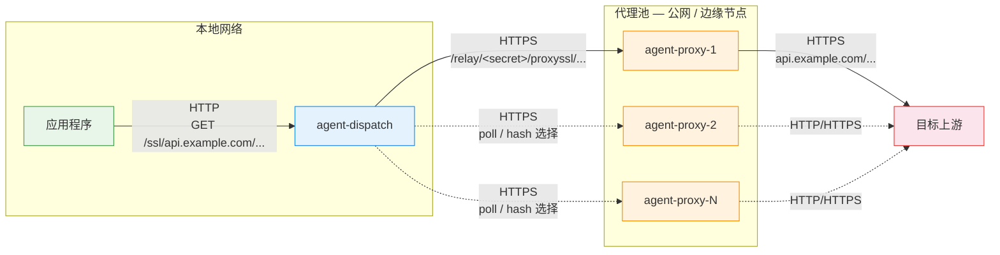

# agent-dispatch

[](./LICENSE)

本地 HTTP 入口网关，将应用请求按可配置策略分发到 [agent-proxy](https://github.com/nulluna/agent-proxy) 池中的某个节点，并通过内部 HTTPS relay 透明转发到目标上游。

## 网络拓扑



**协议说明：**

| 段落 | 协议 | 说明 |
|------|------|------|
| 应用 → agent-dispatch | HTTP | 本地回环，无需加密 |
| agent-dispatch → agent-proxy | HTTPS | 内部 relay，携带 `DISPATCH_SECRET` |
| agent-proxy → 目标上游 | HTTP / HTTPS | 由请求路径前缀决定（`proxy/` = HTTP，`proxyssl/` = HTTPS） |

## 路由语义

```
/<site>/<path>?query        →  http://<site>/<path>?query
/ssl/<site>/<path>?query    →  https://<site>/<path>?query
```

agent-dispatch 接收到请求后，根据分发策略选中一个 agent-proxy 节点，将请求改写为内部 relay 路径：

```
# HTTP 上游
GET /example.com/search?q=test
  → https://<agent-proxy>/relay/<DISPATCH_SECRET>/proxy/example.com/search?q=test

# HTTPS 上游
POST /ssl/api.openai.com/v1/responses
  → https://<agent-proxy>/relay/<DISPATCH_SECRET>/proxyssl/api.openai.com/v1/responses
```

## 分发策略

### `poll`（轮询）

- 按 `AGENTPROXY_POOL` 配置顺序依次选择节点
- 游标仅保存在当前 agent-dispatch 实例内存中
- 轮转至池尾后回绕到第一个节点

### `hash`（哈希）

- 以 `target site + Authorization` 计算稳定索引
- 缺失 `Authorization` 时以空字符串参与哈希
- 池长度或顺序变化会导致映射重排（非一致性哈希）

## 配置项

| 环境变量 | 必填 | 说明 |
|---------|------|------|
| `AGENTPROXY_POOL` | 是 | 逗号分隔的 agent-proxy 节点列表，例如 `https://a.internal,https://b.internal` |
| `DISPATCH_SECRET` | 是 | 与所有 agent-proxy 节点共享的 relay secret |
| `DISPATCH_STRATEGY` | 否 | `poll`（默认）或 `hash` |
| `RELAY_CONNECT_TIMEOUT_MS` | 否 | 内部 relay 连接超时（毫秒） |
| `RELAY_RESPONSE_TIMEOUT_MS` | 否 | 内部 relay 响应流超时（毫秒） |

## 本地开发环境变量

本地运行 `npm run dev` 时，实际执行的是 `wrangler dev`。`agent-dispatch` 运行时读取的是 Worker `env` 绑定，因此本地开发请将环境变量写在与 `wrangler.toml` 同目录的 `.dev.vars` 文件中。

不要把真实 `DISPATCH_SECRET` 或其他敏感值直接手动写进 `wrangler.toml`。`wrangler.toml` 是版本控制文件，改完后很容易误提交，导致 secret 泄漏。

也不要用 `cp wrangler.toml .dev.vars` 这种方式生成本地配置。两者格式不同：
- `wrangler.toml` 是 TOML 配置文件
- `.dev.vars` 是 dotenv 文件

请直接从项目自带模板复制：

```bash
cp .dev.vars.example .dev.vars
```

然后按需填写真实值，再启动本地开发：

```bash
npm run dev
```

`.dev.vars.example` 内容如下：

```dotenv
AGENTPROXY_POOL="https://a.example.com,https://b.example.com"
DISPATCH_SECRET="replace-with-your-shared-secret"
DISPATCH_STRATEGY="poll"
RELAY_CONNECT_TIMEOUT_MS="10000"
RELAY_RESPONSE_TIMEOUT_MS="30000"
```

## 本地模拟 production 环境

如果你想在本地按 `production` 环境启动，不要复用 `.dev.vars`，而是单独创建 `.dev.vars.production`：

```bash
cp .dev.vars.example .dev.vars.production
npm run dev -- --env production
```

注意：
- `.dev.vars.production` 需要把必填项全部写完整
- `wrangler dev --env production` 读取 `.dev.vars.production` 时，不会再合并 `.dev.vars`

## Cloudflare 生产部署

建议把生产环境的运行时配置放到 Cloudflare Worker 的 Variables / Secrets 中，不要把真实值提交到仓库。

推荐至少将以下两个值按 secret 配置：
- `DISPATCH_SECRET`
- `AGENTPROXY_POOL`

命令示例：

```bash
npx wrangler secret put DISPATCH_SECRET --env production
npx wrangler secret put AGENTPROXY_POOL --env production
npx wrangler deploy --env production
```

`DISPATCH_STRATEGY`、`RELAY_CONNECT_TIMEOUT_MS` 和 `RELAY_RESPONSE_TIMEOUT_MS` 没有配置时会回退到代码默认值；如果你需要为 `production` 显式覆盖它们，可以在 Cloudflare Dashboard 中为 `production` 环境单独设置。

## 透明转发边界

agent-dispatch 会尽量保留以下内容：

**请求侧**
- 原始 HTTP method、path、query string
- `Authorization`、`Cookie`、`User-Agent` 等端到端请求头
- 请求 body 流

**响应侧**
- 状态码、`Set-Cookie`、响应头
- 流式响应 body（含 SSE）

hop-by-hop 头部（`Connection`、`Transfer-Encoding`、`Host`、`Content-Length`）不会继续转发，以维持标准代理语义。

## 失败语义

- 选中节点连接失败或内部 relay 异常时，当前请求直接返回错误
- 不会自动 failover 到池中的下一个节点
- 响应流在 relay 阶段超时后会直接中断

## 快速开始

```bash
npm install
npm test
```

常用命令：

```bash
npm run dev          # 本地开发
npm run typecheck    # TypeScript 类型检查
npm test             # 运行测试
npm run build        # Wrangler dry-run 构建
```

## 迁移指南

1. 在所有 agent-proxy 节点配置相同的 `DISPATCH_SECRET`，确认 `/relay/<secret>/proxyssl/...` 可用
2. 部署 agent-dispatch，配置 `AGENTPROXY_POOL`、`DISPATCH_STRATEGY` 和超时参数
3. 将应用入口从"直连 agent-proxy"切换到"访问本地 agent-dispatch 的 `/<site>/...` 或 `/ssl/<site>/...`"
4. 切换完成后，直接访问 agent-proxy 的旧 `/proxy`、`/proxyssl` 入口将持续返回 `404`

## 使用说明与免责声明

- 本项目主要面向个人学习、研究与技术交流场景
- 使用者在部署、修改或集成本项目时，应自行确认其用途符合适用法律法规、目标平台政策以及所在组织的安全与合规要求
- 作者与维护者不对因使用、误用或二次分发本项目产生的直接或间接损失、合规风险或第三方争议承担责任
- 本节为使用说明，具体授权范围仍以项目许可证为准

## License

本项目采用 [GPL-3.0](./LICENSE) 许可证。
